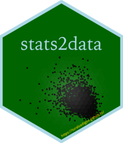

# stats2data

`stats2data` is a data package for MATH 254, Statistical Modeling and Applications, at Hamilton College. Package also includes Quarto templates for weekly homework assignments and the final project. Quarto files will open as R Markdown file (rmd) but will render as qmd files.

To install the package, first install `devtools` package:

`install.packages("devtools")`

Then run the following code in the console:

`devtools::install_github("turalsadigov/stats2data")`
